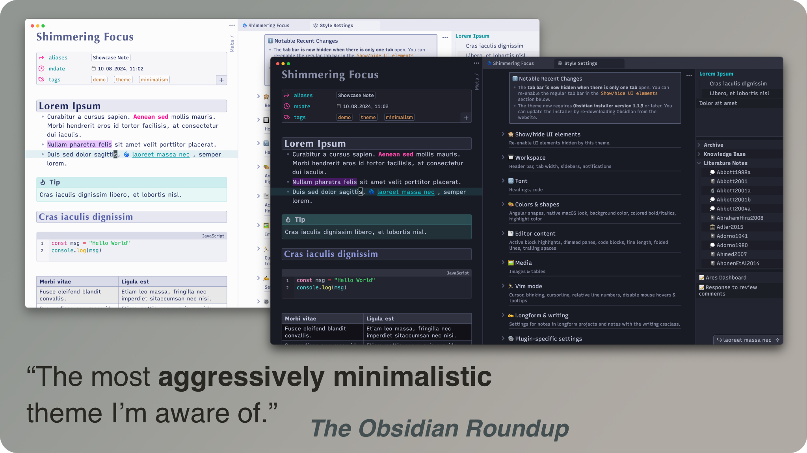
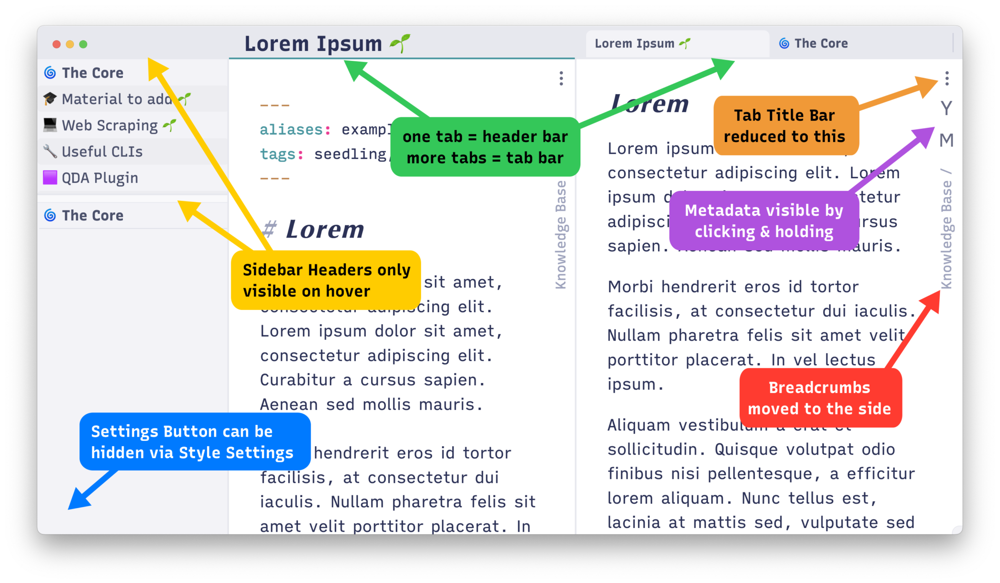

# Shimmering Focus ⟡


A minimalistic and opinionated Obsidian theme for the keyboard-centric user.  
[🏆 Winner Obsidian October 2022 (Category: Theme Update)](https://forum.obsidian.md/t/obsidian-october-2022-winners/49087).



<!-- toc -->

- [Features](#features)
	* [Design Philosophy](#design-philosophy)
	* [Theme Features](#theme-features)
	* [Commands](#commands)
	* [CSS Classes](#css-classes)
	* [Callouts](#callouts)
	* [Private Mode](#private-mode)
	* [Recommended plugins](#recommended-plugins)
- [Contribute](#contribute)
	* [Create and Share your own Color Scheme](#create-and-share-your-own-color-scheme)
	* [Submit Bug Fixes](#submit-bug-fixes)
	* [Credits](#credits)

<!-- tocstop -->

## Features

### Design Philosophy
- __Radical Minimalism:__ As opposed to a minimalism of *colors*, this theme
  focuses on a minimalistic *user interface*: Buttons and sidebars not relevant
  for keyboard users are removed. UI elements that require the mouse are still
	accessible on hover. All hidden UI elements can be permanently re-enabled
	with the [Style Settings
	Plugin](https://obsidian.md/plugins?id=obsidian-style-settings).
- __Condensed Display of Information:__ Unnecessary padding and white-space is
  removed, which is beneficial for small screens or higher zoom levels.
- __High Customizability:__ Dozens of customization options available via [Style
  Settings Plugin](https://obsidian.md/plugins?id=obsidian-style-settings).



### Theme Features
- Emphasis of __Pandoc Citations__ and __Footnotes__. (Install the [Pandoc
  Reference List
  Plugin](https://obsidian.md/plugins?id=obsidian-pandoc-reference-list) for
  improved styling.)
- __Alt-text of images__ is used as __caption__.
- Images can be __zoomed in__ by clicking and holding. You can also toggle
  between reduced and original size via command (requires Style Settings
  Plugin).
- __Code Blocks:__ Various improvements like language display, disabled
  wrapping, and line numbers per code block.
- Extensive Styling for the [Longform
  Plugin](https://obsidian.md/plugins?id=longform), including alternative
  background colors and serif-fonts only for notes in longform projects.
- __Distinguishable Link Types__: Internal links have double underlines,
  external links regular underlines, alias-links dotted underlines, and
  heading-links dashed underlines.
- __Annotation Tags__: Tags that are emphasized when used inline (not in the
  YAML frontmatter). They are meant as visual guides for literature notes. They
  include: `#definition`, `#question`, `#goal`, `#todo`, `#summary`,
  `#important`, `#main`, `#critique`, `#gap`, `#litreview`, `#quote`, `#agree`,
  `#disagree`, `#example`, `#data`, `#method`, `#idea`, `#epistemic-break`, and
  `#sidenote`. To add your own annotation tags, you can use a plugin like
  [Colorful Tags Plugin](https://github.com/rien7/obsidian-colorful-tag).
- __Vim Mode__: Explicit styling of Obsidian's Vim Mode and various style
  settings for vim mode, like for example relative line numbers.
- …

### Commands
When the [Style Settings
Plugin](https://obsidian.md/plugins?id=obsidian-style-settings) is installed,
Shimmering Focus adds commands for toggling theme features:
- Toggle Folding of URLs (Source Mode)
- Toggle between reduced and original image size (reduced size can be set in the
  respective style setting)
- Toggle Private Mode

### CSS Classes
Add a CSS class to your YAML front matter to enable styling only for this
particular note.

```yaml
---
cssclass: name
---
```

Available CSS classes are:
- `full-width`: Disables "Readable Line Length" for the note.
- `private`: Marks note as private. See [Private Mode](#private-mode).
- `writing`: Uses writing-related styling like serif fonts in the note.
- `no-inline-title`: Removes the inline title for that note only.
- `bibliography-list`: Displays lists in the style of academic bibliographies
  (Reading Mode).
- `list-2-col-cards`: Turns list items into two columns of simple cards (Reading
  Mode).
- `remove-dataview-title`: Removes the header from dataview results.
- `larger-table-text`: Slightly larger text in tables.

### Callouts
Shimmering Focus adds a custom `sidenote` callout, which moves the callout to
the side like a small info box. Size and "outdention" can be customized via Style
Settings.

```md
> [!SIDENOTE]
> This note will appear to the side
```

In addition to the sidenote-callout and the [existing callouts from Obsidian
Core](https://help.obsidian.md/How+to/Use+callouts#Types), the theme adds the
following callouts:
- `URL`
- `config`
- `attachment`, `file`

### Private Mode
When the style setting `Private Mode` is enabled, notes with the CSS class
`private` are garbled. Private Mode is intended to be temporarily enabled during
screen sharing in video calls.

Install [Supercharged
Links](https://obsidian.md/plugins?id=supercharged-links-obsidian) and add
`cssclass` to the `Target Attributes for Styling` in its settings to also blur
occurrences of the note name in some plugins like the File Explorer or Quick
Switcher are also blurred. (Note that note content may still show up indirectly
via other plugins, for example in dataview queries.)

You can also use [this standalone
snippet](https://github.com/chrisgrieser/shimmering-focus/blob/main/snippets/private-mode.css)
together with the Style Settings and Supercharged Links plugins to use Private
Mode with a different theme.

### Recommended plugins
- [Style Settings
  Plugin](https://obsidian.md/plugins?id=obsidian-style-settings): Unlocks
  dozens of customization options.
- [Supercharged
  Links](https://obsidian.md/plugins?id=supercharged-links-obsidian): The theme
  includes various built-in styling for the Supercharged Links plugin, for
  example appending a "🌱" to notes with the `#seedling` tag. To enable all
  Supercharged-Links-related features, add `kanban-plugin, status, aliases,
  cssclass` to the `Target Attributes for Styling` text field in the plugin
  settings.
- For academics: [Pandoc Reference List Plugin](https://obsidian.md/plugins?id=obsidian-pandoc-reference-list)
- For macOS: [Electron Window
  Tweaker](https://obsidian.md/plugins?id=obsidian-electron-window-tweaker):
  Position the traffic lights for even more native macOS look (same position as
  in Safari: X = 20, Y = 18). You can even completely hide the traffic lights by
  using negative values, for example X = -60.

> [!NOTE]
> When using the theme, you can disable the *Hider* Plugin, since Shimmering
> Focus already hides far more than the plugin does.

## Contribute

### Create and Share your own Color Scheme
With Shimmering Focus, you can create your own color scheme with this CSS
snippet. You are welcome to [share your color
scheme](https://github.com/chrisgrieser/shimmering-focus/discussions/new?category=share-your-custom-color-schemes).

You can also recreate well-known color schemes and share the snippet for it, so
they might be considered for inclusion in the core theme as a style setting.

```css
.theme-light.theme-light {
    --bg-hue: 230;
    --bg-sat: 25%;

    --color-accent: hsl(184 79% 35%);
    --color-accent-hsl: 184, 79%, 35%;
    --interactive-accent: hsl(184 79% 30%);

    --alt-heading-color: hsl(232 34% 50%);
    --secondary-accent: hsl(28 54% 51%);
    --hover-accent: hsl(328 100% 54%);
    --link-unresolved-color: hsl(101 42% 51%);
}

.theme-dark.theme-dark {
    --bg-hue: 230;
    --bg-sat: 15%;

    --color-accent: hsl(184 79% 45%);
    --color-accent-hsl: 184, 79%, 35%;
    --interactive-accent: hsl(184 79% 30%);

    --alt-heading-color: hsl(232 50% 70%);
    --secondary-accent: hsl(28 63% 61%);
    --hover-accent: hsl(328 100% 64%);
    --link-unresolved-color: hsl(101 42% 51%);
}

/* Note that `--color-accent-hsl` should have the same values as
`--color-accent`, and that `--bg-hue` will override the background colors you
have set in the Style Settings. */
```
<!-- vale Google.FirstPerson = NO -->
### Submit Bug Fixes
Submissions in the following areas are welcome:
- Fixes for Windows or Linux (since I do not own a device for them)
- Fixes for existing bug reports
- Support for a plugin

Please use the [dedicated form for submitting
fixes](https://github.com/chrisgrieser/shimmering-focus/issues/new?template=submit_fix.yml),
so they do not go unnoticed.

### Credits
__About me__  
In my day job, I am a sociologist studying the social mechanisms underlying the
digital economy. For my PhD project, I investigate the governance of the app
economy and how software ecosystems manage the tension between innovation and
compatibility. If you are interested in this subject, feel free to get in touch.

__Profiles__  
- [Academic Website](https://chris-grieser.de/)
- [ResearchGate](https://www.researchgate.net/profile/Christopher-Grieser)
- [Discord](https://discordapp.com/users/462774483044794368/)
- [GitHub](https://github.com/chrisgrieser/)
- [Twitter](https://twitter.com/pseudo_meta)
- [LinkedIn](https://www.linkedin.com/in/christopher-grieser-ba693b17a/)

__Thanks__  
- This theme includes snippets or ideas from:
  [@SlRvb](https://github.com/SlRvb), [@Atlas](https://github.com/zcysxy),
  [@CecilaMay](https://github.com/ceciliamay),
  [@DamianKorcz](https://github.com/damiankorcz),
  [@Mara-Li](https://github.com/Mara-Li), [@kepano](https://github.com/kepano),
  [@jdanielmourao](https://github.com/jdanielmourao),
  [@deathau](https://github.com/deathau/),
  [@MelvinTing](https://github.com/tingmelvin/),
  [@EmrieCandera](https://github.com/Emrie-Candera), @lkadre,
  [@Chetachie](https://github.com/chetachiezikeuzor),
  [@pryley](https://github.com/pryley), and
  [@joelatschool](https://github.com/joelatschool).
- Many theme features are only possible thanks to the [Style Settings
  Plugin](https://obsidian.md/plugins?id=obsidian-style-settings) by
  [@mgmeyers](https://github.com/mgmeyers).
- Thanks for helping me out in my early days of learning CSS:
  [@SlRvb](https://github.com/SlRvb),
  [@javalent](https://github.com/valentine195), and
  [@NothingIsLost](https://github.com/nothingislost).

<a href='https://ko-fi.com/Y8Y86SQ91' target='_blank'>
</a>
