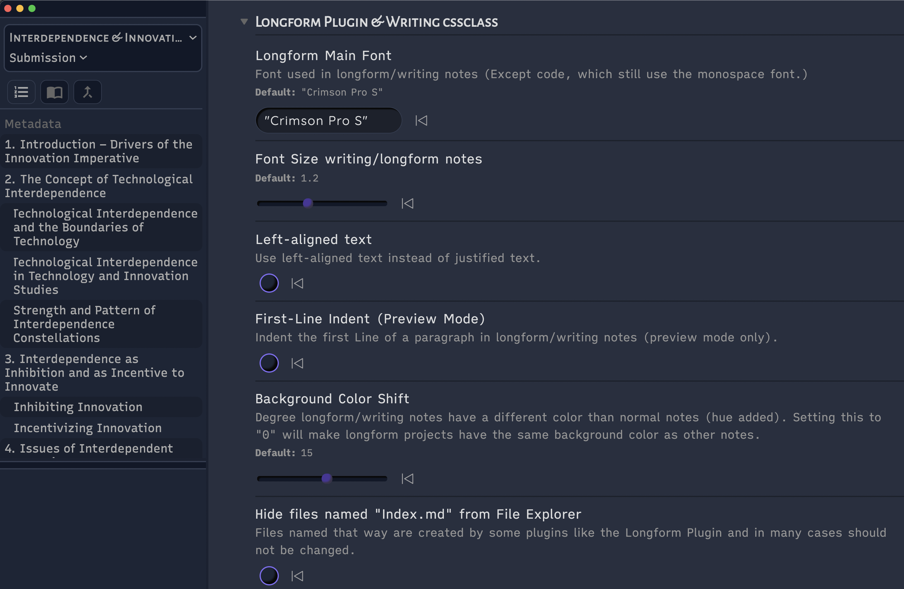

# 🎓 Academics & ✍️ Writers

## For Academics
- [Pandoc Citations](https://pandoc.org/MANUAL.html#citations-in-note-styles) (`[@citekey]`) and footnotes are visually emphasized.
- Footnotes are visually emphasized, too, and have [indicators in the gutter](reading-and-scanning#gutter-indicators).
- The alt-text of images is used as caption text, in line with Pandoc's conversion behavior.
- The [Max View](core-features#max-view--focus-view) is useful for displaying wide markdown tables.
- The [built-in styling for Supercharged Links](plugin-compatibility-and-instructions#built-in-styling-for-supercharged-links) includes tooltips showing the literature note for popups.

## For Writers
- Trailing white spaces are indicated when there is more than one space. This is useful for the Markdown [Two Space Rule](https://daringfireball.net/projects/markdown/syntax#p).
- Extensive Styling and settings specifically for the [Longform Plugin](https://github.com/kevboh/longform). Prepend a `_` to file names of longform scenes to create sub-scenes that are indented in the sidebar.
- The longform plugin as well as the `writing` [cssclass](css-classes) both use a serif font and independent styling, i.e. a different background color.

