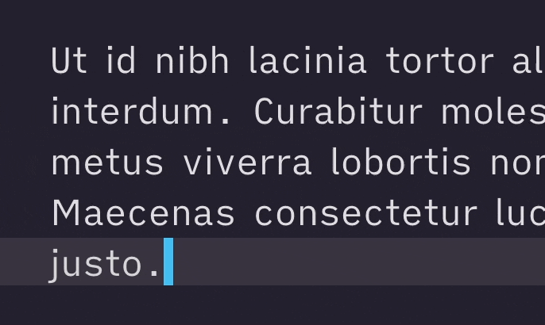

# 🎨 Aesthetics

## Colors

- Theme colors are easily customizable with sliders for Color Tone (Hue), Color Intensity (Saturation), and Brightness (the [HSL Model](https://en.wikipedia.org/wiki/HSL_and_HSV)).
- You can pre-select a preset color scheme, too.
- The theme offers a wide range of more aesthetic or decorative choices, for example round or angular shapes *throughout the whole scheme*.
- Notes that are part of a [Longform](https://github.com/kevboh/longform) project or have the cssclass `writing` have their own independent styling.

## Cursor

The theme also offers a variety of cursor customization:

- Cursor Styles
- Blink Styles
- Block Cursor

