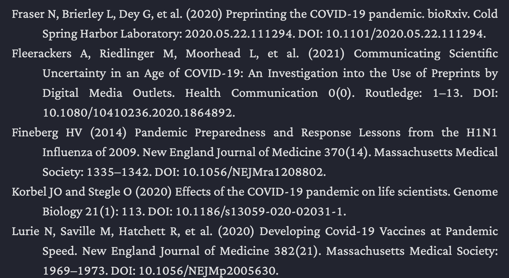

# 📜 CSS Classes & Callouts

<!-- MarkdownTOC -->

- [Callouts](#callouts)
	- [How to use Callouts](#how-to-use-callouts)
	- [Custom Callouts](#custom-callouts)
- [CSS Classes](#css-classes)
	- [How to use CSS Classes](#how-to-use-css-classes)
	- [General Purpose](#general-purpose)
	- [Writing & Academic](#writing--academic)
	- [Dataview](#dataview)

<!-- /MarkdownTOC -->

## Callouts

### How to use Callouts
➡️ Read the info in the [Obsidian Docs](https://help.obsidian.md/How+to/Use+callouts).

### Custom Callouts

```md
> [!LINK]
> [!URL]
```

```md
> [!MAIL]
> [!EMAIL]
```

```md
> [!PHONE]
```

## CSS Classes

### How to use CSS Classes
Add a cssclass to your yaml front matter to activate specific styling of the note in Preview Mode.

```yaml
---
cssclass: name
---
```

The following CSS classes are built in with this theme:

### General Purpose
- `cssclass: clean-top`: Removes Metadata Information, YAML frontmatter, and Breadcrumbs trail from the top of the note.
- `cssclass: clean-embeds`: Embeds in that note are fully embedded, looking like one document.
- `cssclass: list-2-col-cards`: Lists will become cards separated into two columns.
- `cssclass: no-inline-backlinks`: Do not display inline backlinks for that note.
- `cssclass: no-floating-metadata`: Show the Metadata Block and YAML frontmatter in Preview Mode permanently in full.
- `cssclass: tags-in-gutter`: In Preview Mode, shows tags in the gutter.
- `cssclass: full-width`: Use the full width, i.e., turn of readable line length for that note.

### Writing & Academic
- `cssclass: writing`: Applies alternate note styling for writers. [See here for more information](/shimmering-focus/academics-and-writers) (requires Obsidian 0.13.23).
- `cssclass: bibliography-list`: In preview mode, list items are formatted like an academic bibliography.




### Dataview
- `cssclass: dataview-list-in-table`: If you are using a dataview query where some table cells contain lists, use this CSS class to remove the vertical table lines that are off.
- `cssclass: remove-dataview-title`: Removes the title created by some dataview queries.
