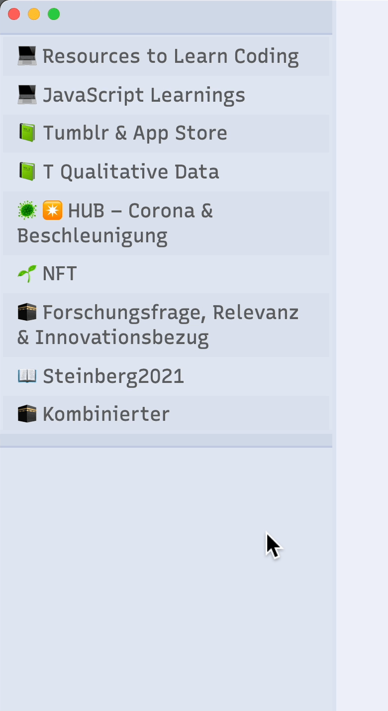

# ⚜️ Design Philosophy

*Shimmering Focus'* Design is based on following four main principles:

## Functional Minimalism

> "the most aggressively 'minimalistic' theme I'm aware of"  
> *– [The Obsidian Roundup](https://www.obsidianroundup.org/2022-01-29/)*

Minimalism is the primary feature of the theme. It's main goal is to remove as much unnecessary clutter as possible, so you can focus on what matters. The primary target group of *Shimmering Focus* are therefore users comfortable with navigating their device mostly with the keyboard.

Nevertheless, the theme is fully functional, through [UI elements becoming visible when hovering](/core-features#hidingshowing-ui-elements) and by allowing you *exactly* [customize what UI elements you want to re-enable](./theme-settings).

## Condensed Information Display
The particular "flavor" of minimalism *Shimmering Focus* strives for should be regarded as *functional*, since minimalism is not a goal in itself, but rather serves the ulterior goals of focus and condensed information display.

The theme's goal is to remove unnecessary spacing and elements whereever possible, resulting in much more information being displayed at the same time. This is particularly relevant for smaller screens and for accessibility.

*Shimmering Focus* deliberately stays away from design choices that look pretty, but cost too much screen real estate (like for example huge headings).

## Readability & Scannability
The third design principle is to maximize readability. The theme exclusibely uses fonts with high readability, increases contrast, and makes unnecessarily thin lines thicker.

As the theme's goal is to achieve minimalism, readability, and condensed information display at the same time, the elements are not distinguished by color or font size differences, but by font type and alignment variation.

In addition, the theme offers [a variety of features around readabiltiy and scannability](reading-and-scanning), for example brightness sliders or indicators in the gutter.

## Subtle Elegance
Being minimalist does not mean that the theme should look plain, to the contrary. While *functional* minimalism means removing expendable elements, the elements that *do* remain receive their share of elegant makeovers.

Subtle, yet elegant design means that the theme aims to look good without being distracting. Examples for this are styling of cursors or checkboxes. Since preferences in this regard vary, the theme offers [a wide range of aesthetic customization choices](color-and-aesthetics).
