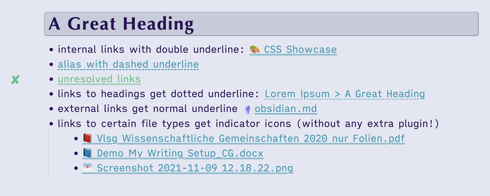

# 👓 Readability & Scannability

## Scannability

- Command Palette: Plugin Names are moved to right
- Visual differentiation of link types

### Gutter Indicators

To increase the scannability of long notes, the presence of some easy-to-miss elements are indicated in the gutter. All indicators can be turned off with the [Style Settings Plugin](https://obsidian.md/plugins?id=obsidian-style-settings).

- Footnotes (all modes)
- Search Result Matches (Source Mode & Live Preview only)
- Unresolved Links (Preview Mode and Live Preview only)
- tags: Using the [cssclass](/shimmering-focus/css-classes) `tags-in-gutter` will display tags in the gutter, similar to keywords in some college books.

{: width="500" }

## Readability

- Brightness and line length are both adjustable via [Style Settings Plugin](https://obsidian.md/plugins?id=obsidian-style-settings).
- Dark Mode for PDFs (when using the theme in dark mode).
- Decreased font size *variation* to increase readability but keep information density.
- The [Max View](/shimmering-focus/core-features#max-view--focus-view) is useful for displaying wide markdown tables.

