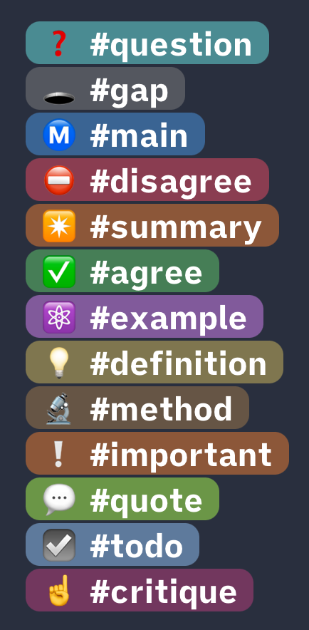

# #️⃣ Special Syntax

## Annotation Tags
Type one of the following tags (e.g. `#definition`) to get a colored annotation tag. Also works in Edit Mode. Intended for Annotations when reading academic papers.

{: width="250" }

💡 To add your own annotation tags, [use this template](https://github.com/chrisgrieser/shimmering-focus/blob/main/CSS%20Snippets/annotation-tag-template.css).

## Citation Syntax
Using a double-blockquote (`>>`) after a normal blockquote (`>`) will result in text formatted like a citation.

## Multi-Color-Highlighting
- Surround highlights with `*` or `**` for alternative highlight colors (`*==cyan==*` and `**==yellow==**`).

## Spoiler Syntax
Emphasized Strikethroughs (`*~~spoiler~~*`) will selectively hide text, except when hovered or the active line.
